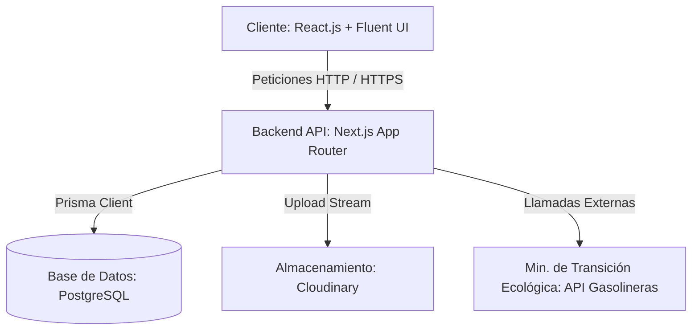

# FlotaGest - Gestión Inteligente de Flotas de Vehículos 🚚

Bienvenido a la documentación oficial de **FlotaGest**, una plataforma integral y robusta diseñada para centralizar, automatizar y optimizar la administración de flotas de vehículos comerciales, la planificación de trayectos, el control del consumo de combustible y la programación de mantenimientos preventivos.

---

## 📝 ÍNDICE DE LA DOCUMENTACIÓN

1. [Introducción y Justificación](#1-introducción-y-justificación)
2. [Arquitectura y Stack Tecnológico](#2-arquitectura-y-stack-tecnológico)
3. [Modelo de Datos y Diagrama Entidad-Relación (ERD)](#3-modelo-de-datos-y-diagrama-entidad-relación-erd)
4. [Enlace de Producción y Despliegue](#4-enlace-de-producción-y-despliegue)
5. [Guía de Instalación y Ejecución Local](#5-guía-de-instalación-y-ejecución-local)
6. [Validación y Pruebas del Proyecto (Robustez del Sistema)](#6-validación-y-pruebas-del-proyecto-robustez-del-sistema)
7. [Retos Técnicos y Lecciones Aprendidas](#7-retos-técnicos-y-lecciones-aprendidas)
8. [Conclusión e Información Relevante](#8-conclusión-e-información-relevante)

---

## 1. Introducción y Justificación

### El Problema que Solventamos

En el sector logístico y de transporte, la gestión operativa diaria suele sufrir de fragmentación de datos. Controlar el estado de los vehículos (disponibles, en ruta o averiados), registrar las hojas de ruta de los conductores, seguir el consumo real de combustible y planificar mantenimientos preventivos en formatos aislados (hojas de cálculo Excel o partes físicos en papel) suele desencadenar:

- **Descontrol de costes indirectos** por desvíos inexplicados en consumo de combustible.
- **Vehículos inactivos de imprevisto** debido a una falta de avisos sistemáticos para revisiones obligatorias e ITV.
- **Errores humanos** al registrar datos manuales, cruzar conductores o encadenar horarios de trayectos que resultan imposibles de cumplir físicamente.

### Finalidad de la Solución

**FlotaGest** es la respuesta unificada a este escenario. Se trata de una plataforma web interactiva enfocada en automatizar procesos y asegurar la coherencia de la información operacional mediante estrictas capas de validación. Sus beneficios clave son:

- **Integridad de Datos Absoluta:** Ningún registro erróneo o contradictorio (como un conductor menor de edad o un trayecto con origen/destino incoherentes) puede ingresar en el sistema.
- **Dashboard Operativo en Tiempo Real:** Monitorización visual del estado global de la flota, posibilitando a los gestores la toma rápida de decisiones comerciales.
- **Mantenimiento Inteligente:** Programación guiada por plantillas según la antigüedad o kilometraje acumulado, reduciendo las paradas de flota no planificadas.

---

## 2. Arquitectura y Stack Tecnológico

El proyecto está diseñado siguiendo una arquitectura de separación limpia de responsabilidades (Client-Server), garantizando la escalabilidad e interoperabilidad de ambos mundos:



### Stack Tecnológico Utilizado

#### Frontend (Cliente)

- **Core:** [React.js](https://react.dev/) v19 + [Vite](https://vitejs.dev/) para conseguir un entorno de desarrollo ultra-veloz y compilados ligeros.
- **UI & Accesibilidad:** [Fluent UI (Microsoft)](https://developer.microsoft.com/en-us/fluentui) proporcionando un lenguaje de componentes premium, altamente accesibles, interactivos y con consistencia empresarial (focalizado en robustez de formularios, modales y cuadrículas de información).

#### Backend & API (Servidor)

- **Core:** [Next.js App Router](https://nextjs.org/) v16. El backend está estructurado con APIs nativas e independientes (`/src/app/api`) bajo convenciones de rutas dinámicas REST, combinando la versatilidad de Node.js con un ruteado declarativo de alta fiabilidad.
- **Capa de Datos (ORM):** [Prisma Client](https://www.prisma.io/) v6.6. Se emplea como motor ORM y constructor de tipos seguro para la comunicación directa con una base de datos **PostgreSQL**.
- **Seguridad & Autenticación:** Cifrado de contraseñas mediante **Bcrypt.js** y control de sesiones sin estado a través de tokens **JSON Web Tokens (JWT)**.
- **Validación de Payloads:** Integración exhaustiva de la librería **Zod** para blindar y parsear las estructuras JSON que entran en la API.
- **Mantenimiento Programado Automatizado:** Ejecución de tareas en segundo plano en el arranque del servidor utilizando `node-cron`.

#### Servicios Cloud

- **Manejo de Imágenes:** Integración con la API de [Cloudinary](https://cloudinary.com/) para el hosting, compresión y optimización dinámica de las fotografías de vehículos e imágenes de perfil de conductores.
- **Procesamiento de Precios Externa (Gasolineras):** Conexión con la API pública de precios de combustibles para extraer estadísticas reales por Municipio, Provincia y CCAA, calculando de forma predictiva el punto más eficiente de repostaje.

---

## 3. Modelo de Datos y Diagrama Entidad-Relación (ERD)

El diseño del modelo relacional persigue la consistencia absoluta, apoyándose en la potencia del tipado estricto y en claves primarias y foráneas de comportamiento controlado. El sistema pivota sobre los siguientes pilares de datos:

1. **Usuario (`User`)**: Almacena las credenciales cifradas, estado (`isActive`) y roles del personal del sistema (`admin`, `user`).
2. **Conductor (`Conductor`)**: Perfil completo del conductor, validado por DNI/NIE, enlazado opcionalmente a un usuario del sistema y vinculado a vehículos asignados.
3. **Vehículo (`Vehiculo`)**: Contiene las especificaciones técnicas completas, consumos medios por Km y capacidades de tanque, vinculándose a viajes, averías y revisiones.
4. **Viajes y Trayectos (`Viaje` & `Trayecto`)**: Estructura de relación jerárquica unívoca. _Un viaje_ general consta de _N trayectos_ ordenados cronológica y geográficamente.
5. **Averías e Incidencias (`Averia`)**: Registro técnico de problemas mecánicos con resolución y control de costes.
6. **Revisiones y Plantillas (`Revision` & `Plantilla` & `Rango`)**: Sistema de alertas e inspecciones sistemáticas asociadas a rangos de antigüedad y kilometraje que avisan del momento idóneo del mantenimiento de cada vehículo.
7. **Imágenes (`Image`)**: Entidad auxiliar que rastrea las rutas públicas de archivos físicos y controla sus referencias directas en Cloudinary.

### Esquema Entidad-Relación

A continuación se muestra el mapa interactivo del modelo relacional del proyecto, generado directamente desde el esquema de Prisma:



---

## 4. Enlace de Producción y Despliegue

### Enlaces del Proyecto en Producción

- **Panel de Usuario / Frontend:** [https://gestion-vehiculos-frontend.vercel.app/](https://gestion-vehiculos-frontend.vercel.app/)
- **Endpoints API / Backend:** [https://gestion-vehiculos-backend.vercel.app/api](https://gestion-vehiculos-backend.vercel.app/api)

### Flujo de Integración y Despliegue Continuo (CI/CD)

El ciclo de vida del desarrollo de la aplicación se encuentra automatizado con pipelines avanzados:

- **Vercel Integration:** Tanto el Frontend como el Servidor Next.js están vinculados a sus respectivos repositorios oficiales en GitHub.
- **Actualizaciones Automáticas Zero-Downtime:** Con cada subida (`push`) o fusión (`merge`) aprobada en la rama principal (`main`), los servidores de Vercel compilan el código fuente, validan dependencias, generan el cliente de base de datos y despliegan la nueva versión. El proceso es inmediato (menos de 60 segundos) y no produce interrupciones en la disponibilidad del servicio.

---

## 5. Guía de Instalación y Ejecución Local

Para ejecutar tanto el servidor API como el frontend localmente en tu ordenador, sigue las siguientes instrucciones detalladas:

### Requisitos Previos

- **Node.js** (Versión 16.x, 18.x o superior).
- **npm** (instalado junto a Node.js).
- Base de datos **PostgreSQL** o acceso a una base de datos compatible.

---

### Paso A: Levantar el Servidor API Backend

1. **Clonar el Repositorio de la API:**

   ```bash
   git clone https://github.com/4lwep/Gestion_Vehiculos_Backend.git
   cd Gestion_Vehiculos_Backend
   ```

2. **Instalar Dependencias de la API:**

   ```bash
   npm install
   ```

3. **Preparar la Base de Datos:**
   Aplica las migraciones del esquema y opcionalmente ejecuta el script de semillas (`seed`) para precargar usuarios administrador, vehículos de demostración y plantillas base de mantenimiento:

   ```bash
   # Generar cliente y sincronizar esquema
   npx prisma db push

   ```

4. **Arrancar Entorno de Desarrollo Backend:**
   ```bash
   npm run dev
   ```
   El servidor API se iniciará por defecto en `http://localhost:3000/`. Puedes probar el estado o ver el catálogo abierto del estándar OpenAPI en `http://localhost:3000/openapi.yaml`.

---

### Paso B: Levantar el Frontend Client (`Gestion_Vehiculos_Frontend`)

1. **Clonar el Repositorio del Cliente React:**

   ```bash
   git clone https://github.com/CarlosCS06/Gestion_Vehiculos_Frontend.git
   cd Gestion_Vehiculos_Frontend
   ```

2. **Instalar Dependencias del Cliente:**

   ```bash
   npm install
   ```

3. **Arrancar Entorno de Desarrollo Frontend:**
   ```bash
   npm run dev
   ```
   Abre tu navegador de preferencia y accede a la dirección web que se imprimirá en tu consola (generalmente `http://localhost:5173/`).

---

## 6. Validación y Pruebas del Proyecto (Robustez del Sistema)

Para garantizar la fiabilidad del software empresarial, implementamos una capa intensiva de preventores lógicos y validaciones tanto en el cliente como en el servidor:

### A. Validaciones Reales de Identidad Española

- **Validación de DNI / NIE:** Tanto al registrarse un usuario como al dar de alta un conductor, el backend y el frontend ejecutan el algoritmo matemático reglamentario para validar la letra del DNI o el NIE (cálculo por módulo 23). Esto descarta identificaciones inventadas o tecleadas erróneamente en los formularios.
- **Validación de Teléfonos:** Se exige el formato reglamentario español (+34 o longitud de 9 dígitos numéricos empezando por 6, 7 o 9) para evitar números incompletos.

### B. Validaciones de Negocio y Lógica de Fechas

- **Mayoría de Edad:** El motor de registro rechaza sistemáticamente el alta de perfiles de conductor si la fecha de nacimiento ingresada indica que la persona tiene menos de 18 años.
- **Cronología del Vehículo:** Al registrar o actualizar las propiedades de un coche o camión, se valida de forma cruzada que la fecha de compra de la unidad sea cronológicamente igual o posterior a la fecha de matriculación oficial del vehículo.

### C. Coherencia Absoluta de Hojas de Ruta (Trayectos)

- **Validación de Intervalos:** Al componer un viaje que contenga trayectos, se verifica que la hora de llegada de un trayecto sea estrictamente posterior a la hora de salida de ese mismo segmento.
- **Encadenamiento Topológico:** Se fuerza por validación iterativa que el destino registrado en el Trayecto `N` sea exactamente idéntico al origen registrado en el Trayecto `N+1`. Esto impide "saltos espaciales" incoherentes en las hojas de ruta de los conductores.

### D. Blindaje Multirrol del Lado del Servidor (Payload Hardening)

La seguridad no se basa en el mero hecho de ocultar botones en la interfaz de React:

- **Protección de Rutas del Cliente:** Los usuarios con rol `user` tienen bloqueada y redirigida cualquier ruta que intente listar cuentas.
- **Blindaje del Payload (Hardening):** Si un usuario malintencionado edita el Javascript local o utiliza software como Postman para enviar propiedades de administrador al actualizar un recurso (por ejemplo, intentar resolver una avería o escribir una fecha de finalización de taller para no pagar), el servidor realiza un filtrado preventivo. Si el rol que realiza la petición no contiene permisos de administración, todos los campos técnicos e inputs sensibles del JSON entrante son forzados estrictamente a `null` / `false` antes de tocar la capa ORM, protegiendo así la lógica de negocio y las finanzas de la empresa de accesos indebidos.

---

## 7. Retos Técnicos y Lecciones Aprendidas

### Reto A: Sincronización Automática de los Estados del Vehículo

- **El Desafío:** Era complejo mantener actualizado y libre de errores humanos el estado global del vehículo (`DISPONIBLE`, `EN_TRAYECTO`, `AVERIADO`) a medida que los conductores daban de alta viajes, abrían trayectos o reportaban averías. La base de datos corría el peligro de desincronizarse (ej. marcar un coche disponible cuando en realidad tenía una ruta activa en ese instante).
- **La Solución:** Diseñamos un motor desencadenador lúdico y asíncrono. Cada vez que el sistema carga o se interactúa con el módulo de Viajes, se ejecuta una consulta optimizada que evalúa la ventana temporal activa y los vehículos implicados en trayectos sin finalizar, corrigiendo los estados automáticamente en la base de datos de manera fluida y 100% transparente para el usuario final.

### Reto B: Tratamiento de Fechas entre Sistemas (Timezones HTML5 vs ISO)

- **El Desafío:** Las discrepancias horarias producidas entre las entradas de fechas locales de los navegadores (`datetime-local` en el HTML5 de React) y la codificación internacional en formato ISO UTC que exige PostgreSQL y Prisma causaban fallos en las comparaciones cronológicas y desfases de huso horario de hasta +2 horas.
- **La Solución:** Centralizamos la gestión horaria en un módulo utilitario universal (`dateUtils.js`). Este archivo se encarga de estandarizar, neutralizar desplazamientos UTC y formatear de manera uniforme tanto la entrada visual del usuario como el almacenamiento seguro en la BD.

### Reto C: Seguridad Ante Inyecciones Locales del Estado del Navegador

- **El Desafío:** Impedir que usuarios sin privilegios forzaran propiedades manipulando el estado cargado de React o simulando llamadas directas HTTP.
- **La Solución:** Estudiamos la estrategia de diseño defensivo orientada al Payload. En vez de depender exclusivamente del front, el backend descarta proactivamente campos sensibles en las rutas PATCH y POST basándose en el rol decodificado del JWT, validándolo directamente en funciones utilitarias en el archivo `/src/createEntityData.js`.

---

## 8. Conclusión e Información Relevante

**FlotaGest** representa una herramienta de software moderna y preparada para entornos profesionales. Al centralizar la información bajo estrictas reglas lógicas, no solo simplifica las gestiones diarias del personal, sino que dota a las empresas de una herramienta de analítica y prevención del error indispensable para garantizar la rentabilidad de las flotas.

---

_Desarrollado con dedicación en el marco de Proyectos Finales de Desarrollo de Aplicaciones Web (DAW)._
